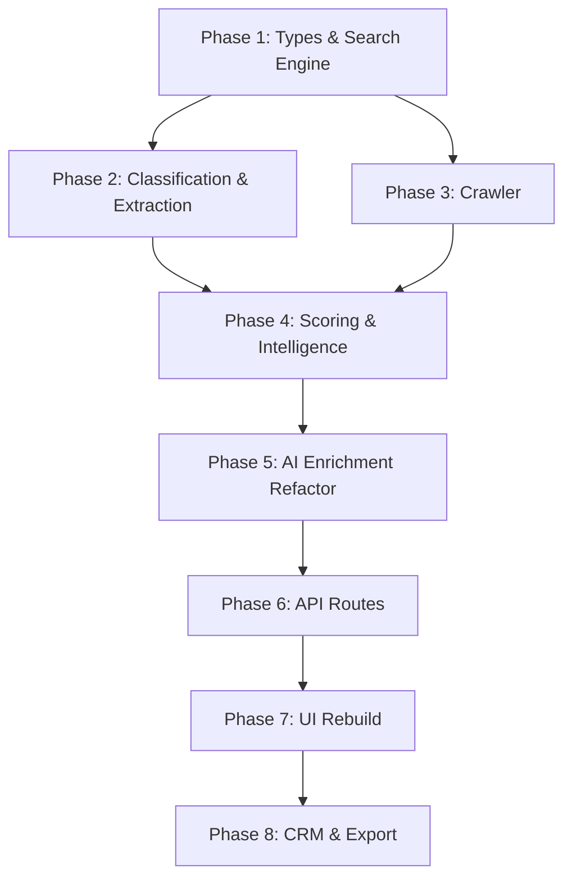

# JobJet — Architectural Pivot & Implementation Plan

> **From**: JobJet (Upwork automation tool)  
> **To**: JobJet (B2B Lead Generation & Job Intelligence Platform)

---

## Executive Summary

This plan transforms JobJet from a single-source freelance scraper into a modular, multi-source business intelligence platform. The pivot replaces Upwork-specific code with a plugin-based discovery engine, a URL classification system, multi-provider search abstraction, and a comprehensive lead scoring pipeline built around buying signals rather than job boards.

---

## Audit of Current Codebase

### What Exists (Preserve & Evolve)

| Module | Path | Verdict |
|---|---|---|
| Supabase Auth (SSR) | [supabase/](file:///c:/Users/tochu/Documents/studio/src/lib/supabase) | ✅ **Keep as-is** — solid auth foundation |
| AI Provider Abstraction | [providers/](file:///c:/Users/tochu/Documents/studio/src/ai/providers) | ✅ **Keep & extend** — Gemini/Claude gateway works, add more models later |
| Enrichment Pipeline | [enrichment/](file:///c:/Users/tochu/Documents/studio/src/enrichment) | ✅ **Keep & refactor** — enrichGig → enrichCompany, enrichLead stays |
| Lead Scoring | [scoring/](file:///c:/Users/tochu/Documents/studio/src/scoring) | ✅ **Keep & expand** — add buying signal scores |
| Prompt Templates | [prompts/](file:///c:/Users/tochu/Documents/studio/src/ai/prompts) | ✅ **Keep outreach/research prompts**, remove Upwork-specific language |
| Genkit Setup | [genkit.ts](file:///c:/Users/tochu/Documents/studio/src/ai/genkit.ts) | ✅ **Keep** — Genkit + Google AI plugin is fine |
| AI Flows | [flows/](file:///c:/Users/tochu/Documents/studio/src/ai/flows) | ⚠️ **Rename & refactor** — keep cover-letter and resume, remove Upwork context |
| UI Shell | [app-shell.tsx](file:///c:/Users/tochu/Documents/studio/src/components/app-shell.tsx) | ⚠️ **Major rewrite** — navigation groups must change completely |
| shadcn/ui Components | [components/ui/](file:///c:/Users/tochu/Documents/studio/src/components/ui) | ✅ **Keep all** — design system unchanged |
| Type Definitions | [types/](file:///c:/Users/tochu/Documents/studio/src/types) | ⚠️ **Major rewrite** — new domain types needed |
| Middleware | [middleware.ts](file:///c:/Users/tochu/Documents/studio/src/middleware.ts) | ✅ **Keep** — session guard unchanged |

### What Gets Deleted

| File/Route | Reason |
|---|---|
| `src/scrapers/upwork.ts` | Upwork scraping is removed from scope |
| `src/app/upwork-gigs/page.tsx` | Replaced by `/companies` and `/jobs` |
| `src/app/automated-application/page.tsx` | No longer relevant (was Upwork auto-apply) |
| `src/app/api/scrape/upwork/route.ts` | Replaced by multi-source discovery API |
| `src/app/api/research/gig/route.ts` | Merged into company intelligence API |
| `Gig` type and `GigStatus`, `ExperienceLevel`, `ProjectType` | Replaced by `Company`, `Job`, `Lead` types |

---

## Proposed New Directory Structure

```
src/
│
├── middleware.ts                          # Supabase session guard (KEEP)
│
├── ai/                                    # AI layer (EVOLVE)
│   ├── genkit.ts                          # Genkit instance (KEEP)
│   ├── flows/
│   │   ├── company-analyzer.ts            # NEW: Analyze company data
│   │   ├── lead-analyzer.ts              # NEW: Analyze individual leads
│   │   ├── outreach-generator.ts         # RENAME: from outreach flow
│   │   ├── proposal-generator.ts         # KEEP
│   │   ├── resume-generator.ts           # KEEP
│   │   ├── cover-letter-generator.ts     # KEEP
│   │   └── smart-search.ts              # KEEP
│   ├── prompts/
│   │   ├── research.ts                   # REFACTOR: Remove Upwork, add company/lead prompts
│   │   ├── outreach.ts                   # EXTRACT: From current index.ts
│   │   └── proposal.ts                  # EXTRACT: From current index.ts
│   └── providers/                        # KEEP AS-IS
│       ├── claude.ts
│       ├── gemini.ts
│       ├── index.ts
│       └── types.ts
│
├── app/                                   # Next.js App Router (MAJOR REWRITE)
│   ├── layout.tsx                        # MODIFY: Update metadata, branding
│   ├── page.tsx                          # Landing page
│   ├── globals.css                       # KEEP
│   │
│   ├── (auth)/                           # Route group: public auth pages
│   │   ├── auth/
│   │   │   ├── page.tsx                  # Login/Register (KEEP)
│   │   │   └── callback/
│   │   │       └── route.ts             # OAuth callback (KEEP)
│   │
│   ├── (platform)/                       # Route group: protected pages
│   │   ├── layout.tsx                    # NEW: Platform layout with sidebar
│   │   ├── dashboard/
│   │   │   └── page.tsx                 # REWRITE: New metrics
│   │   ├── discovery/
│   │   │   └── page.tsx                 # NEW: Multi-source search UI
│   │   ├── companies/
│   │   │   └── page.tsx                 # NEW: Company database
│   │   ├── jobs/
│   │   │   └── page.tsx                 # NEW: Job listings (multi-board)
│   │   ├── leads/
│   │   │   └── page.tsx                 # REWRITE: B2B lead management
│   │   ├── crm/
│   │   │   └── page.tsx                 # NEW: CRM view
│   │   ├── outreach/
│   │   │   └── page.tsx                 # KEEP & REFACTOR
│   │   ├── proposals/
│   │   │   └── page.tsx                 # KEEP & REFACTOR
│   │   ├── ai-studio/
│   │   │   └── page.tsx                 # KEEP
│   │   ├── analytics/
│   │   │   └── page.tsx                 # NEW: Pipeline analytics
│   │   ├── settings/
│   │   │   └── page.tsx                 # KEEP
│   │   └── feedback/
│   │       └── page.tsx                 # KEEP
│   │
│   └── api/                              # API Routes (MAJOR REWRITE)
│       ├── search/                       # NEW: Search provider endpoints
│       │   └── route.ts
│       ├── discover/                     # NEW: Discovery pipeline
│       │   ├── companies/
│       │   │   └── route.ts
│       │   └── jobs/
│       │       └── route.ts
│       ├── crawl/                        # NEW: Website crawling
│       │   └── route.ts
│       ├── classify/                     # NEW: URL classification
│       │   └── route.ts
│       ├── enrich/                       # REFACTOR: Company + Lead enrichment
│       │   └── route.ts
│       ├── score/                        # REFACTOR: Lead scoring
│       │   └── route.ts
│       ├── proposals/
│       │   └── generate/
│       │       └── route.ts             # KEEP
│       ├── outreach/
│       │   └── generate/
│       │       └── route.ts             # KEEP
│       └── feedback/
│           └── route.ts                 # KEEP
│
├── core/                                  # NEW: Core engine modules
│   ├── search/                           # Search provider abstraction
│   │   ├── types.ts                     # SearchProvider interface
│   │   ├── google.ts                    # Google Custom Search
│   │   ├── bing.ts                      # Bing Search API
│   │   ├── brave.ts                     # Brave Search API
│   │   ├── manager.ts                   # Provider rotation + dedup
│   │   └── index.ts                     # Barrel export
│   ├── crawler/                          # Website crawler
│   │   ├── browser.ts                   # Playwright browser management
│   │   ├── page-crawler.ts             # Single page extraction
│   │   ├── site-crawler.ts             # Multi-page site crawling
│   │   └── index.ts
│   ├── classifier/                       # URL classification engine
│   │   ├── types.ts                     # URLCategory enum
│   │   ├── rules.ts                     # Heuristic classification rules
│   │   ├── ai-classifier.ts            # AI-assisted classification
│   │   └── index.ts
│   ├── extractor/                        # Data extraction from pages
│   │   ├── contacts.ts                  # Email, phone extraction
│   │   ├── company.ts                   # Company info extraction
│   │   ├── jobs.ts                      # Job listing extraction
│   │   ├── technology.ts               # Tech stack detection
│   │   ├── social.ts                    # Social media link extraction
│   │   └── index.ts
│   ├── cache/                            # Result caching
│   │   └── index.ts
│   └── proxy/                            # Proxy rotation (Phase 2)
│       └── index.ts
│
├── scoring/                              # EXPAND
│   ├── company.ts                       # NEW: Company scoring
│   ├── lead.ts                          # REFACTOR: From current index.ts
│   ├── buying-signals.ts               # NEW: Signal-based scoring
│   └── index.ts                         # Barrel export
│
├── enrichment/                           # REFACTOR
│   ├── company.ts                       # NEW: Company enrichment
│   ├── lead.ts                          # EXTRACT: From current index.ts
│   ├── technology.ts                    # NEW: Tech stack enrichment
│   └── index.ts
│
├── intelligence/                          # NEW: Business intelligence
│   ├── company-profile.ts              # Build full company profiles
│   ├── hiring-signals.ts               # Detect hiring activity
│   ├── website-audit.ts                # Assess website quality
│   └── index.ts
│
├── crm/                                   # NEW: CRM utilities
│   ├── export.ts                        # CSV/Excel export
│   ├── deduplicate.ts                   # Dedup leads/companies
│   └── index.ts
│
├── components/                           # UI Components (EVOLVE)
│   ├── app-shell.tsx                    # REWRITE: New nav structure
│   ├── loading-button.tsx               # KEEP
│   ├── features/                        # NEW: Feature-specific components
│   │   ├── discovery-form.tsx           # Search configuration UI
│   │   ├── company-card.tsx             # Company display card
│   │   ├── lead-card.tsx               # Lead display card
│   │   ├── job-card.tsx                # Job display card
│   │   ├── score-badge.tsx             # Score visualization
│   │   └── pipeline-status.tsx         # Pipeline progress indicator
│   └── ui/                             # KEEP ALL shadcn components
│
├── hooks/                                # KEEP & EXTEND
│   ├── use-mobile.tsx                   # KEEP
│   ├── use-toast.ts                     # KEEP
│   ├── use-discovery.ts                 # NEW: Discovery pipeline hook
│   └── use-pipeline-status.ts          # NEW: Pipeline status polling
│
├── lib/                                  # KEEP & EXTEND
│   ├── utils.ts                         # KEEP
│   ├── mock-data.ts                     # REWRITE: New mock data shapes
│   └── supabase/                        # KEEP ALL
│       ├── client.ts
│       ├── middleware.ts
│       └── server.ts
│
└── types/                                # MAJOR REWRITE
    ├── company.ts                       # Company, CompanyScore
    ├── lead.ts                          # Lead, LeadScore, LeadSource
    ├── job.ts                           # Job, JobSource
    ├── search.ts                        # SearchQuery, SearchResult, SearchProvider
    ├── discovery.ts                     # DiscoveryPipeline, URLCategory
    ├── outreach.ts                      # OutreachMessage, OutreachSequence
    ├── proposal.ts                      # Proposal types
    ├── feedback.ts                      # Feedback types
    ├── crm.ts                           # CRM export types
    └── index.ts                         # Barrel re-exports
```

---

## Open Questions

> [!IMPORTANT]
> **Search API Choice**: For Phase 1, do you want to start with Google Programmable Search Engine (free tier: 100 queries/day, paid: $5/1000 queries) or Brave Search API (free tier: 2000 queries/month)? I recommend **Brave Search** for MVP since it has a generous free tier and no CAPTCHA issues.

> [!IMPORTANT]
> **Database Schema**: Should I create Supabase migration SQL files for the new tables (`companies`, `jobs`, `leads_v2`, `contacts`, `searches`, `pipeline_runs`), or are you managing migrations manually through the Supabase dashboard?

> [!NOTE]
> **Branding**: Keeping "JobJet" throughout. No rebranding needed.

---

## New Navigation Structure

**Before (JobJet):**
```
Overview:        Dashboard
Intelligence:    Upwork Gigs | Lead Generation
Creation:        Proposals | Outreach | Resume | Cover Letter
Tools:           Smart Search | Profile Optimizer
System:          AI Studio | Scraping Jobs | Feedback
```

**After (JobJet):**
```
Overview:        Dashboard
Discovery:       Search & Discover | Companies | Jobs
Leads:           Lead Database | CRM
Generation:      Proposals | Outreach
Intelligence:    AI Studio | Analytics
System:          Pipeline Monitor | Feedback | Settings
```

---

## New Type Definitions (Core Domain)

```typescript
// ─── Company ─────────────────────────────────────
export interface Company {
  id: string;
  name: string;
  website?: string;
  industry?: string;
  size?: 'startup' | 'small' | 'medium' | 'large' | 'enterprise';
  location?: string;
  description?: string;
  techStack?: string[];
  socialLinks?: SocialLink[];
  contacts?: Contact[];
  hiringStatus?: 'active' | 'passive' | 'unknown';
  websiteScore?: number;        // 0–100 quality score
  fundingStage?: string;
  lastScrapedAt?: string;
  source: string;               // Where we found them
  score?: number;               // Overall lead score
  buyingSignals?: BuyingSignal[];
}

// ─── Buying Signals ──────────────────────────────
export interface BuyingSignal {
  type: string;                 // 'hiring' | 'outdated_website' | 'no_ssl' | etc.
  description: string;
  weight: number;               // Score contribution
  detectedAt: string;
}

// ─── Search ──────────────────────────────────────
export type SearchProvider = 'google' | 'bing' | 'brave' | 'duckduckgo';

export interface SearchQuery {
  keywords: string;
  targetType: 'company' | 'job' | 'smb' | 'individual' | 'rfp';
  industry?: string;
  location?: string;
  providers: SearchProvider[];
  maxResults: number;
  excludeKeywords?: string;
}

// ─── URL Classification ─────────────────────────
export type URLCategory =
  | 'company' | 'job_board' | 'ats' | 'startup_directory'
  | 'recruitment_agency' | 'government' | 'education'
  | 'ngo' | 'social_profile' | 'ignore';
```

---

## Task Breakdown

### Phase 1: Foundation — Types, Core Engine & Auth (3–5 days)

- [ ] **1.1** Create new type definition files (`types/company.ts`, `types/lead.ts`, `types/job.ts`, `types/search.ts`, `types/discovery.ts`)
- [ ] **1.2** Create `types/index.ts` barrel export (replacing old Gig-centric types)
- [ ] **1.3** Create `core/search/types.ts` — `SearchProvider` interface with `search(query): Promise<SearchResult[]>`
- [ ] **1.4** Implement `core/search/brave.ts` — Brave Search API adapter (MVP default)
- [ ] **1.5** Implement `core/search/google.ts` — Google Custom Search adapter
- [ ] **1.6** Create `core/search/manager.ts` — Provider rotation, deduplication, rate limiting
- [ ] **1.7** Create `core/search/index.ts` barrel export
- [ ] **1.8** Update `src/app/layout.tsx` — Change metadata title/description

**Definition of Done**: `SearchManager.search(query)` returns deduplicated results from Brave Search. TypeScript compiles with `npm run typecheck`.

---

### Phase 2: Classification & Extraction Engine (3–4 days)

- [ ] **2.1** Create `core/classifier/types.ts` — `URLCategory` enum, `ClassificationResult` interface
- [ ] **2.2** Implement `core/classifier/rules.ts` — Heuristic URL classification (domain patterns, path patterns)
- [ ] **2.3** Implement `core/classifier/ai-classifier.ts` — Genkit-based fallback classification
- [ ] **2.4** Create `core/extractor/contacts.ts` — Extract emails, phones from page HTML
- [ ] **2.5** Create `core/extractor/company.ts` — Extract company name, description, address
- [ ] **2.6** Create `core/extractor/technology.ts` — Detect tech stack from HTML/headers
- [ ] **2.7** Create `core/extractor/social.ts` — Extract social media links
- [ ] **2.8** Create `core/extractor/jobs.ts` — Extract job listings from career pages

**Definition of Done**: Given a URL, the system classifies it, crawls it, and returns structured data. Unit tests pass for each extractor.

---

### Phase 3: Crawler & Browser Management (2–3 days)

- [ ] **3.1** Create `core/crawler/browser.ts` — Playwright browser pool (reuse from `scrapers/upwork.ts` system-browser logic)
- [ ] **3.2** Create `core/crawler/page-crawler.ts` — Single page HTML + metadata extraction
- [ ] **3.3** Create `core/crawler/site-crawler.ts` — Follow links to contact/about/careers pages
- [ ] **3.4** Create `core/cache/index.ts` — In-memory LRU cache for URLs already crawled
- [ ] **3.5** Delete `src/scrapers/upwork.ts`
- [ ] **3.6** Delete `src/scrapers/leads.ts`

**Definition of Done**: `crawlSite("https://example.com")` returns structured pages. System browser fallback works.

---

### Phase 4: Scoring & Intelligence (2–3 days)

- [ ] **4.1** Create `scoring/buying-signals.ts` — Detect and score: no HTTPS, old copyright, missing mobile, broken links, hiring indicator
- [ ] **4.2** Create `scoring/company.ts` — Aggregate signal scores into a company score
- [ ] **4.3** Refactor `scoring/lead.ts` — Extract from current `scoring/index.ts`, expand with new signals
- [ ] **4.4** Create `intelligence/website-audit.ts` — SSL check, mobile responsiveness, speed, analytics detection
- [ ] **4.5** Create `intelligence/hiring-signals.ts` — Detect career pages, job postings, "we're hiring" signals
- [ ] **4.6** Create `intelligence/company-profile.ts` — Build full company profile from all sources

**Definition of Done**: Given crawled company data, `scoreCompany()` returns a 0–100 score with itemized signal breakdown.

---

### Phase 5: Enrichment & AI Pipeline Refactor (2–3 days)

- [ ] **5.1** Extract `enrichment/lead.ts` from current `enrichment/index.ts` (keep `enrichLead`, remove `enrichGig`)
- [ ] **5.2** Create `enrichment/company.ts` — AI-powered company analysis (replaces `enrichGig`)
- [ ] **5.3** Create `enrichment/technology.ts` — Tech stack analysis + modernization scoring
- [ ] **5.4** Refactor `ai/prompts/index.ts` — Split into `research.ts`, `outreach.ts`, `proposal.ts`; remove all Upwork-specific language
- [ ] **5.5** Update `ai/flows/` — Rename `profile-optimizer.ts` → keep, add `company-analyzer.ts`, `lead-analyzer.ts`

**Definition of Done**: `enrichCompany()` and `enrichLead()` return AI-generated insights using the new prompt templates. No reference to "Upwork" remains in any prompt.

---

### Phase 6: API Routes (3–4 days)

- [ ] **6.1** Create `api/search/route.ts` — POST endpoint for multi-provider search
- [ ] **6.2** Create `api/discover/companies/route.ts` — Full discovery pipeline: search → classify → crawl → extract → enrich → score
- [ ] **6.3** Create `api/discover/jobs/route.ts` — Job discovery from career pages and job boards
- [ ] **6.4** Create `api/crawl/route.ts` — On-demand single URL crawl + extraction
- [ ] **6.5** Create `api/classify/route.ts` — URL classification endpoint
- [ ] **6.6** Create `api/enrich/route.ts` — Enrichment endpoint (company or lead)
- [ ] **6.7** Create `api/score/route.ts` — Scoring endpoint
- [ ] **6.8** Delete `api/scrape/upwork/route.ts`
- [ ] **6.9** Delete `api/research/gig/route.ts`
- [ ] **6.10** Keep & update `api/proposals/generate/route.ts` — Remove Upwork language
- [ ] **6.11** Keep & update `api/outreach/generate/route.ts` — Update to use new Lead type

**Definition of Done**: `POST /api/discover/companies` triggers the full pipeline and returns scored companies. Old Upwork routes deleted.

---

### Phase 7: UI Rebuild (4–5 days)

- [ ] **7.1** Rewrite `components/app-shell.tsx` — New navigation groups (Discovery, Leads, Generation, Intelligence, System)
- [ ] **7.2** Create `components/features/discovery-form.tsx` — Search configuration form (target type, industry, location, keywords, providers)
- [ ] **7.3** Create `components/features/company-card.tsx` — Company display with score badge
- [ ] **7.4** Create `components/features/lead-card.tsx` — Lead display with buying signals
- [ ] **7.5** Create `components/features/job-card.tsx` — Job listing card
- [ ] **7.6** Create `components/features/score-badge.tsx` — Visual score indicator (0–100)
- [ ] **7.7** Create `components/features/pipeline-status.tsx` — Discovery pipeline progress
- [ ] **7.8** Rewrite `app/(platform)/dashboard/page.tsx` — New metrics (companies found, leads scored, pipeline status)
- [ ] **7.9** Create `app/(platform)/discovery/page.tsx` — Discovery page with search form + results
- [ ] **7.10** Create `app/(platform)/companies/page.tsx` — Company database table
- [ ] **7.11** Create `app/(platform)/jobs/page.tsx` — Job listings table
- [ ] **7.12** Rewrite `app/(platform)/leads/page.tsx` — B2B lead management view
- [ ] **7.13** Create `app/(platform)/crm/page.tsx` — CRM with export functionality
- [ ] **7.14** Create `app/(platform)/analytics/page.tsx` — Pipeline analytics dashboard
- [ ] **7.15** Delete `app/upwork-gigs/page.tsx`
- [ ] **7.16** Delete `app/automated-application/page.tsx`

**Definition of Done**: Full navigation works. Discovery page triggers search and displays results. No "Upwork" or "Gig" references remain in UI.

---

### Phase 8: CRM & Export (1–2 days)

- [ ] **8.1** Create `crm/export.ts` — Export companies/leads to CSV
- [ ] **8.2** Create `crm/deduplicate.ts` — Deduplicate companies/leads by domain/email
- [ ] **8.3** Create `hooks/use-discovery.ts` — React hook for discovery pipeline state
- [ ] **8.4** Create `hooks/use-pipeline-status.ts` — Pipeline progress polling hook

**Definition of Done**: User can export discovered companies/leads as CSV. Deduplication prevents duplicate entries.

---

## Testing Strategy

### Testing Pyramid

```
              /\
             / E2E \          ← Discovery → Results flow
            /--------\
           /Integration\      ← API routes, search providers, DB
          /--------------\
         /   Unit Tests    \  ← Extractors, classifiers, scorers, prompts
        /--------------------\
```

### Priority 1 — Test Now (High impact, Low effort)
- **Unit**: All extractors (`contacts.ts`, `company.ts`, `technology.ts`, `social.ts`)
- **Unit**: URL classifier rules (`rules.ts`)
- **Unit**: Scoring functions (`buying-signals.ts`, `company.ts`, `lead.ts`)
- **Unit**: Search manager deduplication logic

### Priority 2 — Test Soon (High impact, Higher effort)
- **Integration**: `POST /api/search` returns valid results from Brave API
- **Integration**: `POST /api/discover/companies` full pipeline returns scored companies
- **Integration**: Enrichment pipeline produces valid AI-generated insights

### Priority 3 — Test Eventually
- **E2E**: User fills discovery form → results appear → user exports to CSV
- **E2E**: Auth flow → protected routes guard correctly

### Priority 4 — Acceptable Gap
- Static UI components (cards, badges)
- shadcn/ui components (third-party)

### Coverage Targets
| Code Area | Target |
|---|---|
| `core/extractor/*` | 95% |
| `core/classifier/*` | 90% |
| `scoring/*` | 95% |
| `core/search/manager.ts` | 85% |
| API route handlers | 80% |
| React components | 60% |

---

## Build Order & Dependencies



> [!WARNING]
> **Breaking Change**: This plan deletes `src/scrapers/upwork.ts`, `src/app/upwork-gigs/`, and `src/app/automated-application/`. All Upwork-related functionality will be permanently removed. The `Gig` type will no longer exist.

> [!IMPORTANT]
> **Parallel Track**: Phases 2 and 3 can run simultaneously since classification and crawling are independent subsystems that only converge in Phase 4.

---

## Verification Plan

### Automated Tests
```bash
npm run typecheck          # TypeScript compilation
npm run test:unit          # Unit tests for extractors, classifiers, scorers
npm run test:integration   # API route integration tests
```

### Manual Verification
1. Run `npm run dev` and verify new navigation renders
2. Fill discovery form → trigger search → verify results appear
3. Click a company → verify enrichment data loads
4. Export leads → verify CSV downloads correctly
5. Auth flow → verify protected routes redirect correctly
